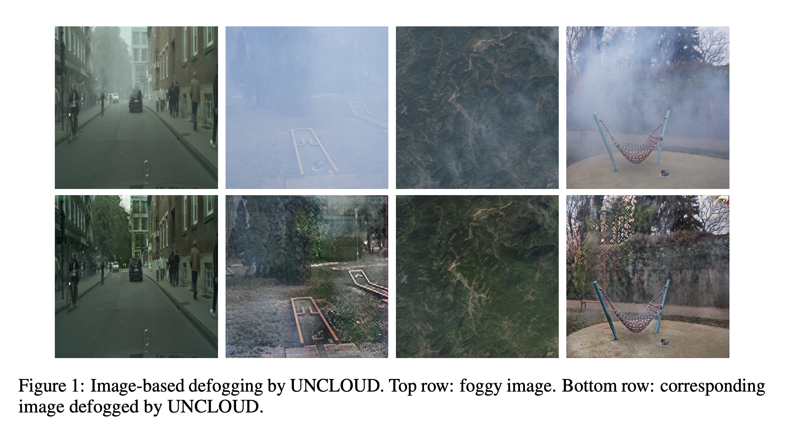

# UNCLOUD: Universal Image Defogging Using Image Inpainting Techniques

This repository is the official implementation of **UNCLOUD**. 



## Requirements

To install requirements:

```setup
conda env create -f environment.yml
conda activate UNCLOUD
```


## Data Preparation

### Datasets
The following datasets were used during our experiments:
- [Foggy Cityscapes](http://people.ee.ethz.ch/~csakarid/SFSU_synthetic/) (during our experiments, we locally named the dataset in our file directory as `cityscapes`)
- [DENSE-HAZE](https://data.vision.ee.ethz.ch/cvl/ntire19//dense-haze/) (during our experiments, we locally named the dataset in our file directory as `dense-haze`)
- [FRIDA](http://perso.lcpc.fr/tarel.jean-philippe/bdd/frida.html) (during our experiments, we locally named the dataset in our file directory as `frida`)
- [FRIDA2](http://perso.lcpc.fr/tarel.jean-philippe/bdd/frida.html) (during our experiments, we locally named the dataset in our file directory as `frida2`)
- [I-HAZE](https://data.vision.ee.ethz.ch/cvl/ntire18//i-haze/) (during our experiments, we locally named the dataset in our file directory as `i-hazy-nitre`)
- [NH-HAZE](https://data.vision.ee.ethz.ch/cvl/ntire20/nh-haze/) (during our experiments, we locally named the dataset in our file directory as `nitre`)
- [O-HAZE](https://data.vision.ee.ethz.ch/cvl/ntire18//o-haze/) (during our experiments, we locally named the dataset in our file directory as `o-hazy-nitre`)
- [RS-Haze](https://drive.google.com/drive/folders/1wVOdhYZVPvlekK7w5tmsOO52mNAigkOJ) (during our experiments, we locally named the dataset in our file directory as `small-aerial`)

*Our local names for each dataset in our file directory were included for transparency and reproducability of the experiment.*

### Data Directory Layout
Training and testing data should first be stored in the following directory structure:

```
data-root
├── [dataset_x]
│   ├── foggy-[dataset_x]
│   │   ├── **/test
│   │   │      └ **/*.png
│   │   ├── **/train
│   │   │      └ **/*.png
│   │   └── **/val
│   │          └ **/*.png
│   │
│   ├── gt-[dataset_x]
│   │   ├── **/test
│   │   │      └ **/*.png
│   │   ├── **/train
│   │   │      └ **/*.png
│   │   └── **/val
│   │          └ **/*.png
│   │
│   └── mask-[dataset_x]
│
.
.
.
```

Note that in the above file directory layout:
- `[dataset_x]` should be replaced with the name of the dataset being used.
- Repeat the above `[dataset_x]` sub-directory structure for each dataset being used.
- `mask-[dataset]` should be an empty folder.
- For each training image `subfolder/**/[image].png` within the test, train, and val folder of `foggy-[dataset_x]`, the corresponding non-foggy ground truth image in the test, train, and val folder of the `gt-[dataset_x]` **must** have the same relative path and file name `subfolder/**/[image].png`.

### Fog Mask Synthesis
To synthesize fog mask, navigate to the `fog-mask` directory and run `mask.py`.

`mask.py` recognizes the following arguments:  
- `--foggy-dir`: the path to the directory containing foggy images.
- `--mask-dir`: the path to the directory where fog masks corresponding to images in the foggy-dir are to be stored.
- `--resume`: an optional argument which resumes a fog mask synthesis run for a `foggy-dir` and `mask-dir` which as previously interrupted.

For the file directory specified in the [Data Directory Layout Section](#data-directory-layout), the following command should be run for **EACH** dataset.
```
cd data-root/[dataset_x]
python mask.py --foggy-dir ./foggy-[dataset_x] --mask-dir ./mask-[dataset_x]
```

*Note: each fog mask in `mask-dir` will be named `mask_[image].png` where `[image]` is the corresponding foggy image. Also, `mask_[image].png` will have the same relative subdirectory path in `mask-dir` as `[image].png` in `foggy-dir`. If the relative subdirectory path does not yet exist in `mask-dir`, `mask.py` will automatically create it*


## Training

To train UNCLOUD, run the train.py file. There are many optional arguments included. The notable parameters are as follows:
- `--data_root`: path to data directory.
- `--save_dir`: path to directory where intermediate snapshots of the model should be saved to.
- `--max_iter`: maximum number of iterations to train the model.
- `--batch_size`: batch size used to train the model.
- `--save_model_interval`: intervals of iterations at which the intermediate model snapshot should be saved.
- `--vis_interval`: intervals of iterations at which the intermediate model's results should be visualized.
- `--image_size`: size which the images should be resized to before being fed into model. Model takes square images of size `image_size`x`image_size`.
- `--resume`: path to previous pretrained model to resume training from.
- `--finetune`: finetune model.


The specific command used to train the model in the UNCLOUD paper is
```train
cd fog-inpainting
python train.py --data_root data-root --image_size 512
```

*Note that the default values were used for all other parameters.*

### Finding Best Trained Model
After training, there will be many saved snapshots of the model saved in the specified `save_dir` directory. If `save_dir` was not specified during training, snapshots are saved in `fog-inpainting/snapshots/default/ckpt` by default, and their respective visual evaluations are saved in `fog-inpainting/snapshots/default/images` by default. To find the best saved snapshot, run `find_best_model.py`. The arguments for `find_best_model.py` are as follows:
- `--root`: path to data directory.
- `--snapshot-dir`: path to directory containing snapshots of model.
- `--pth-interval`: intervals at which paths in `snapshot-dir` are saved. This parameter should match the `save_model_interval` parameter used in [`train.py`](#training).
- `--max-pth`: the maximum path snapshot in `snapshot-dir` that the user wants to consider up to when evaluating snapshots in `snapshot-dir`.
- `--image-size`: image size that model is capable of handling. This parameter should match the `image_size` parameter used in [`train.py`](#training).
- `--metric-file`: metric file used to store calculated metrics for each snapshot considered.

The specific command used to find the best model in the UNCLOUD paper is
```
cd fog-inpainting
python find_best_model.py --root data-root --snapshot-dir ./snapshots/default/ckpt --pth-interval 1000 --max-pth 148000.pth --image-size 512
```
*Note a `max-pth` of 148000 was used since the model was trained for 148000 iterations. Also, a `pth-interval` of 1000 and `image-size` of 512 were used because during [training](#training), a `save_model_interval` and `image_size` of 1000 and 512 respectively were used. These parameters may be different for each user based on the parameters they used and their total training time.*

## Evaluation
UNCLOUD is evaluated upon three metrics:
1. Mean Squared Error (MSE)
2. Peak Signal-To-Noise Ratio (PSNR)
3. Structural Similarity (SSIM)

To evaluate the performance of UNCLOUD, two methods are provided. The first is `test.py`, which loads in and evaluates using validation data from the user's `data-root` defined in the [Data Preparation Section](#data-directory-layout). The second is `metrics.py` which assumes that the user already has defogged versions of each image to evaluate against corresponding foggy images.

### test.py
`test.py` contains the following arguments:
- `--root`: path to data directory.
- `--snapshot`: path to the snapshot of model being evaluated.
- `--image_size`: image size that model is capable of handling. This parameter should match the `image_size` parameter used in [`train.py`](#training).
- `--metric-file`: metric file used to store calculated metrics for the snapshot being evaluted.
- `--save-dir`: directory where foggy input images, ground truth images, and their corresponding non-foggy image defogged by UNCLOUD are to be stored. *Note that these images will be transformed to `image_size`x`image_size`, which is what the model uses as input.*
- `--specific-dataset`: optional parameter to specify a specific dataset to evaluate the model on.
- `--abs-data-cap`: optional parameter that only applies when the `specific-dataset` parameter is specified. The `abs-data-cap` specifies a maximum number of images that can be used from the `specific-dataset` to evalate the model.
- `--save-img`: optional parameter that specifies whether the foggy, ground truth, and defogged images used during testing should be saved. *Note that the `save-dir` argument must be specified when `save-img` is included as an argument.
- `--use-edge-metrics`: optional parameter that specifies whether `test.py` should also produce edge metrics in addition to the metrics specified above. Edge metrics are the MSE, PSNR, and SSIM evaluated on edge-traced versions of each foggy/defogged image and ground truth image.

To evaluate the pretrained model (specified later in the [Pretrained Model Section](#pre-trained-model)) on the Foggy Cityscapes dataset, run the following command:

```eval
cd fog-inpainting
test.py --root data-root --snapshot ./pretrained-model/38000.pth --image_size 512 --metric-file [metric.txt file] --save-dir [save directory] --specific-dataset cityscapes --save-img
```

*Note that if no `specific-dataset` is specified, then `test.py` will evaluate the model using 1 image from each dataset. If there are more than 8 datasets in `data-root`, then `test.py` evaluates using 1 image from each of the first 8 datasets it finds in `data-root`*

### metrics.py
`metrics.py` produces the same metrics as those produced by `test.py`. However, `metrics.py` assumes that the user has already obtained and can provide defogged images and their corresponding foggy images and ground truths. The arguments used by `metrics.py` are as follows:
- `--foggy-dir`: directory containing foggy images.
- `--defogged-dir`: directory containing corresponding defogged images.
- `--gt-dir`: directory containing corresponding ground truth images.
- `--metric-file`: metric file used to store calculated metrics for the snapshot being evaluted.
- `--edge-dir`: directory where edge-traced versions of foggy, defogged, and ground truth images are to be stored. Note that this does not apply if the `use-edge-metrics` parameter below is not used.
- `--use-edge-metrics`: optional parameter that specifies whether `metrics.py` should also produce edge metrics in addition to the metrics specified above. Edge metrics are the MSE, PSNR, and SSIM evaluated on edge-traced versions of each foggy/defogged image and ground truth image.

*Note that the only required naming scheme between corresponding files in the `figgy-dir`, `defogged-dir`, and `gt-dir` is that when each of these directories are alphanumerically sorted, corresponding files have the same index. Thus it is best practice for corresponding files in each of these folders to have the same name. Alternatively, another good option would be to name corresponding files as `[file_name]_foggy.jpg`, `[file_name]_defogged.jpg`, and `[file_name]_gt.jpg`, where `[filename]` is the same between all 3 files.*

*Examples of `metrics.py` usage are included in the [Comparing Experiment Results to Other State of the Art Models Section](#comparing-experiment-results-to-other-state-of-the-art-models).*
## Pre-trained Model

The pretrained model used in the UNCLOUD paper can be downloaded [here](https://drive.google.com/drive/folders/1A0tEHwH_lJESX0B5f_1D5EJQT6g3mjzI?usp=sharing) and should be stored in `/fog-inpainting/pretrained-model`.

## Comparing Experiment Results to Other State of the Art Models

When evaluating our results, we compared UNCLOUD to 5 other state of the art models:
- [AOD-Net](https://github.com/Boyiliee/AOD-Net)
- [Dark Channel Prior Method (DCP)](https://github.com/He-Zhang/image_dehaze)
- [DehazeFormer-S](https://github.com/IDKiro/DehazeFormer)
- [FFA-Net](https://github.com/zhilin007/FFA-Net)
- [GridDehaze-Net](https://github.com/proteus1991/GridDehazeNet)

### Preparation
Before comparing models, we first created a skeleton directory containing each model's defogging results on the same images from each dataset:

```
comparison
├── [dataset_x]
│   ├── AOD-Net
│   │   ├── edge
│   │   ├── output
│   │   ├── edge_metrics.txt
│   │   └── metrics.txt
│   │
│   ├── DCP
│   │   ├── edge
│   │   ├── output
│   │   ├── edge_metrics.txt
│   │   └── metrics.txt
│   │
│   ├── DehazeFormer-S
│   │   ├── edge
│   │   ├── output
│   │   ├── edge_metrics.txt
│   │   └── metrics.txt
│   │
│   ├── FFA-Net
│   │   ├── edge
│   │   ├── output
│   │   ├── edge_metrics.txt
│   │   └── metrics.txt
│   │
│   ├── GridDehazeNet
│   │   ├── edge
│   │   ├── output
│   │   ├── edge_metrics.txt
│   │   └── metrics.txt
│   │
│   └── UNCLOUD
│       ├── img
│       │   ├── edge
│       │   ├── gt
│       │   ├── input
│       │   └── output
│       ├── edge_metrics.txt
│       └── metrics.txt
│
.
.
.
```

Above, `[dataset-x]` should be replaced by datasets from the [Dataset Section](#datasets). Then, for each dataset, the UNCLOUD subdirectory should be populated using `test.py`.

```
python test.py --root data-root --snapshot ./pretrained-model/38000.pth --image_size 512 --metric-file /comparison/[dataset_x]/UNCLOUD/metrics.txt --save-dir /comparison/[dataset_x]/UNCLOUD --specific-dataset [dataset_x] --save-img
```

If desired, the `edge_metrics.txt` file in each UNCLOUD subdirectory may be populated using `metrics.py`.

```
python metrics.py --foggy-dir /comparison/[dataset_x]/UNCLOUD/img/input --defogged-dir /comparison/[dataset_x]/UNCLOUD/img/output --gt-dir /comparison/[dataset_x]/UNCLOUD/img/gt --metric-file /comparison/[dataset_x]/UNCLOUD/edge_metrics.txt --edge-dir /comparison/[dataset_x]/UNCLOUD/img/edge --use-edge-metrics
```

Next, for each dataset `[dataset-x]`, the `output` folder for each model `[model]`(AOD-Net, DCP, DehazeFormer-S, FFA-Net, and GridDehazeNet) should be populated by running each respective model on the foggy images located in `/comparison/[dataset-x]/UNCLOUD/img/input` and saving their results in the corresopnding `/comparison/[dataset-x]/[model]/output` folder.

To populate the `metrics.txt` file for each model, use `metrics.py`.
```
python metrics.py --foggy-dir /comparison/[dataset_x]/UNCLOUD/img/input --defogged-dir /comparison/[dataset_x]/[model]/output --gt-dir /comparison/[dataset_x]/UNCLOUD/img/gt --metric-file /comparison/[dataset_x]/[model]/metrics.txt
```

If desired, to populate the `edge_metrics.txt` file for each model, use `metrics.py`.
```
python metrics.py --foggy-dir /comparison/[dataset_x]/UNCLOUD/img/input --defogged-dir /comparison/[dataset_x]/[model]/output --gt-dir /comparison/[dataset_x]/UNCLOUD/img/gt --metric-file /comparison/[dataset_x]/[model]/edge_metrics.txt --edge-dir /comparison/[dataset_x]/[model]/edge --use-edge-metrics
```

After populating each folder and empty file within the skeleton `comparison` folder, the comparison between UNCLOUD and other state of the art models can be made using `compare_models.py`. *Note that `compare_models.py` only makes comparisons for one dataset at a time.
```
python compare_models.py --dir /comparison/[dataset-x]/
```

When run, `compare_models.py` prints the average MSE, average PSNR, and average SSIM of each model for the respective dataset. The best performing model for each metric is labeled `[WINNER]`. The results from this comparison across all datasets are depicted in the [Results Section](#results) below.

## Results

### UNCLOUD achieves the following performance in comparison to other state of the art models:

*Best results for each metric are **bolded**.*


| Datasets | Metrics | AOD-Net |   DCP   | DehazeFormer-S | FFA-Net | GridDehazeNet | <mark>**UNCLOUD**</mark> |
| -------- | ------- | ------- | ------- | -------------- | ------- | ------------- | ----------- |
| DENSE-HAZE | MSE   | 5672.38 | 5246.69   | 9114.87   | 9378.37   | 9040.86   | **3490.18**
|          | PSNR  | 10.95     | 11.43     | 8.71      | 8.82      | 8.85      | **13.64**
|          | SSIM  | 0.41      | 0.44      | 0.39      | 0.39      | 0.39      | **0.47**
|          |    |  |  |    |   |      | 
| Foggy Cityscapes | MSE   | 1597.33   | 1374.51   | 1422.37   | 2224.10   | 948.96    | **391.40**
|          | PSNR  | 16.41     | 16.95     | 18.07     | 16.38     | 19.57     | **23.30**
|          | SSIM  | 0.70      | 0.70      | 0.86      | 0.83      | 0.85      | **0.91**
|          |    |  |  |    |   |      | 
| FRIDA | MSE | 2984.69 | 3536.67 | 3250.27 | 4272.12 | 2565.19 | **988.19**
|          | PSNR | 13.70 | 12.73 | 13.28 | 12.16 | 14.21 | **18.22**
|          | SSIM | 0.76 | 0.67 | 0.78 | 0.76 | 0.76 | **0.79**
|          |    |  |  |    |   |      | 
| FRIDA2 | MSE | 4811.90 | 4862.15 | 5068.84 | 6430.35 | 4760.07 | **2525.45**
|          | PSNR | 11.46 | 11.45 | 11.26 | 10.19 | 11.50 | **14.29**
|          | SSIM | 0.71 | 0.58 | 0.71 | 0.72 | 0.66 | **0.73**
|          |    |  |  |    |   |      | 
| I-HAZE | MSE | 1928.72 | 3341.57 | 1992.92 | 3467.84 | 2447.57 | **1550.85**
|          | PSNR | 15.70 | 13.07 | 15.60 | 12.78 | 14.58 | **16.25**
|          | SSIM | 0.70 | 0.65 | **0.74** | 0.66 | 0.70 | 0.72
|          |    |  |  |    |   |      | 
| NH-HAZE | MSE | 3452.60 | 2932.75 | 4352.65 | 4438.24 | 3777.76 | **1877.34**
|          | PSNR | 12.93 | 13.64 | 11.99 | 11.92 | 12.51 | **15.65**
|          | SSIM | 0.37 | 0.45 | 0.41 | 0.40 | 0.43 | **0.60**
|          |    |  |  |    |   |      | 
| O-HAZE | MSE | 2002.58 | 1582.42 | 1012.50 | 1564.98 | 1481.03 | **620.52**
|          | PSNR | 15.16 | 16.63 | 18.33 | 16.62 | 16.47 | **20.83**
|          | SSIM | 0.62 | 0.69 | 0.71 | 0.66 | 0.70 | **0.83**
|          |    |  |  |    |   |      | 
| RS-HAZE | MSE | 2960.33 | 1129.68 | 6311.72 | 6695.18 | 3689.70 | **973.20**
|          | PSNR | 14.80 | 18.32 | 12.80 | 12.12 | 14.63 | **20.52**
|          | SSIM | 0.52 | 0.63 | 0.58 | 0.56 | 0.60 | **0.71**


## References
Portions of code within this repository were borrowed from the following 2 sources:
- [1]: [Unofficial pytorch implementation of 'Image Inpainting for Irregular Holes Using Partial Convolutions' [Liu+, ECCV2018]](https://github.com/naoto0804/pytorch-inpainting-with-partial-conv)
- [2]: [Official implementation of Single Image Haze Removal Using Dark Channel Prior](https://github.com/He-Zhang/image_dehaze)